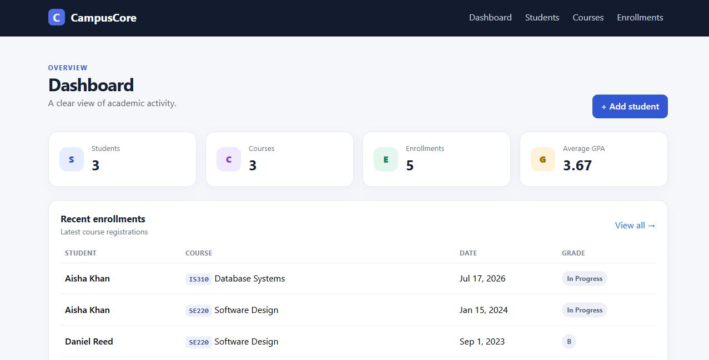
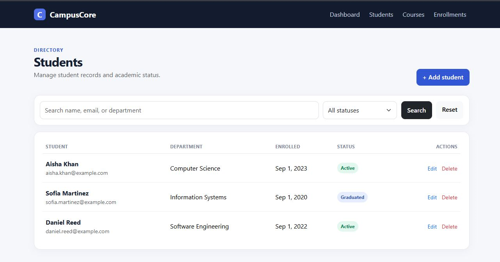
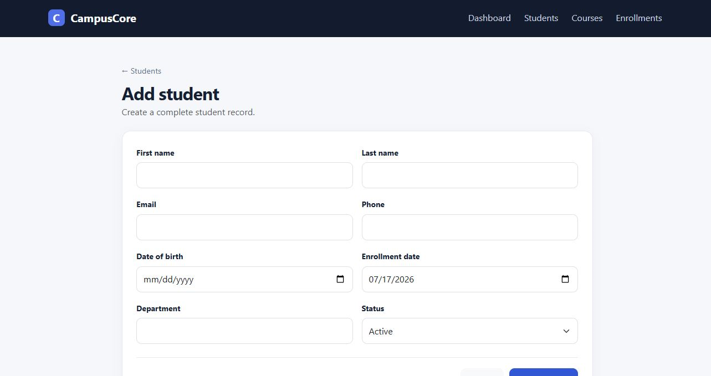
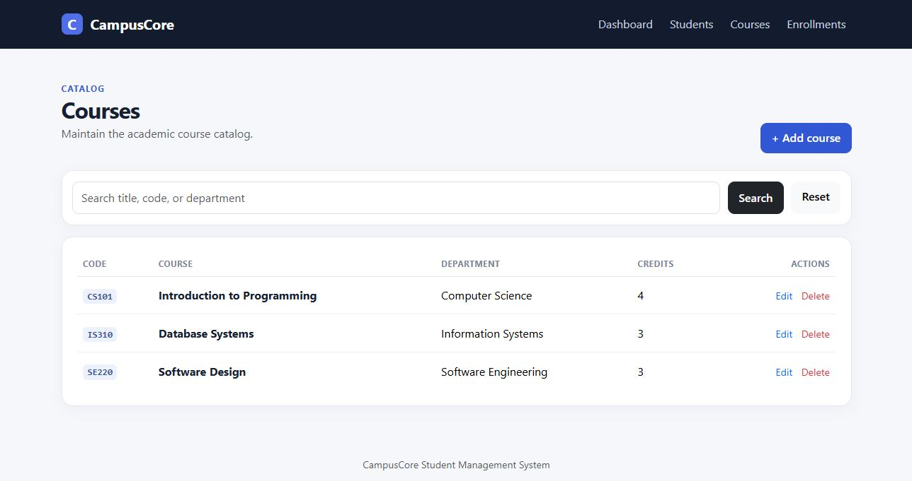
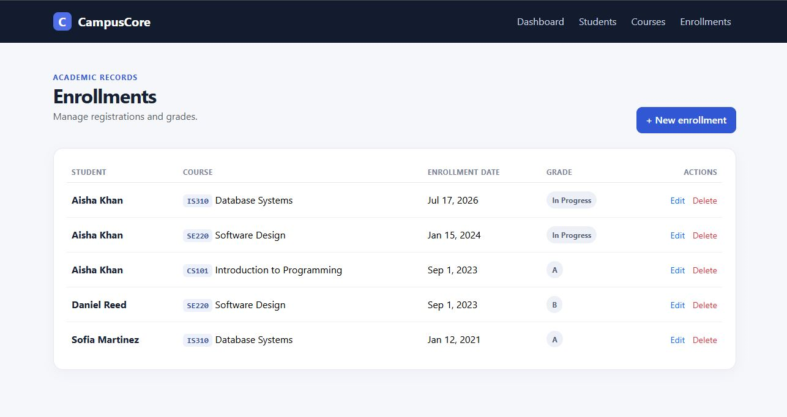

# CampusCore — Student Management System

A professional ASP.NET Core MVC application for managing students, courses, enrollments, and grades. CampusCore is intentionally scoped as a focused Version 1 portfolio project: it demonstrates practical C#, MVC, Entity Framework Core, relational data modeling, validation, and responsive UI work without placeholder features or unnecessary infrastructure.

## Features

- Dashboard with student, course, enrollment, and GPA summary cards
- Recent enrollment activity
- Full student CRUD with profile and course history
- Full course CRUD with enrolled-student detail
- Enrollment creation, grade assignment, editing, and deletion
- Student search by name, email, or department and status filtering
- Course search by title, code, or department
- Server- and client-side validation with friendly messages
- Unique email, course code, and student/course enrollment constraints
- Responsive custom Bootstrap interface, empty states, and delete confirmation pages
- SQLite database, initial EF Core migration, and realistic demo seed data

## Tech stack

- .NET 8 / ASP.NET Core MVC
- C#
- Entity Framework Core 8
- SQLite
- Razor views
- Bootstrap 5 with custom CSS

## Project structure

```text
student-management-system-dotnet/
├── Controllers/       MVC request handlers and filtering
├── Data/              AppDbContext and demo-data initializer
├── Migrations/        Initial EF Core database migration
├── Models/            Student, Course, and Enrollment domain models
├── ViewModels/        Dashboard-specific presentation model
├── Views/             Razor views grouped by feature
├── wwwroot/css/       Custom responsive application styling
├── Program.cs         Service registration and request pipeline
└── appsettings.json   SQLite connection configuration
```

## Setup

Prerequisites: [.NET 8 SDK](https://dotnet.microsoft.com/download/dotnet/8.0).

```bash
git clone <your-repository-url>
cd student-management-system-dotnet
dotnet restore
dotnet tool install --global dotnet-ef
dotnet ef database update
dotnet run
```

Open the HTTP or HTTPS address printed by `dotnet run`. On first startup, the app also applies pending migrations and adds demo records when the database is empty.

## Database migrations

Create a migration after changing the model:

```bash
dotnet ef migrations add DescribeYourChange
dotnet ef database update
```

The local `studentmanagement.db` file is ignored by Git. Delete it and run `dotnet ef database update` to reset local data; demo data is inserted when the application next starts.

## Screenshots

### Dashboard



### Students



### Student form



### Courses



### Enrollments



## Deployment notes

This repository is configured for local SQLite development. For production, use environment-based connection strings, select a production-supported database provider, apply migrations through the release process, enable HTTPS, and add appropriate authentication/authorization. No production deployment is claimed by this project.

## Future improvements

- Authentication and role-based authorization for administrators and staff
- Pagination for large student and course lists
- Audit history for grade and enrollment changes
- Exportable reports
- Automated unit and integration tests
- Production database configuration

## Limitations

- Version 1 intentionally has no authentication or authorization.
- SQLite and in-process seed logic are aimed at local/demo use.
- GPA uses a simple A=4, B=3, C=2, D=1, F=0 average and excludes in-progress enrollments; it is not credit-weighted.
- Search uses straightforward database string matching.
- Course/student deletion cascades to related enrollments after an explicit confirmation page.
